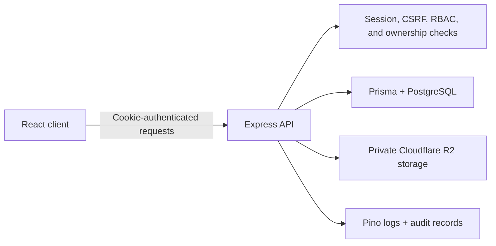

# Stafflow

Stafflow is a full-stack employee management app for a single company. It gives administrators one place to manage day-to-day people operations and gives employees a private self-service workspace.

The project is designed as a safe public portfolio demo. Visitors can use seeded accounts, but the backend rejects persistent business and identity mutations, so they cannot register a company or turn the shared demo into their own workspace. Login/logout are the bounded session-lifecycle exception. Exact route and non-persistence coverage is recorded under audit Sections 03–04 in the [Section 25 regression matrix](context/audit-25-regression-matrix.md).

## Current interface

### Homepage


### Admin dashboard


## What Stafflow includes

| Area        | Administrators                                                          | Employees                                              |
| ----------- | ----------------------------------------------------------------------- | ------------------------------------------------------ |
| Dashboard   | View company-wide attendance, leave, employee, and department summaries | View personal attendance, leave, and payslip summaries |
| Employees   | Create, invite, update, disable, and review records outside demo mode   | View and update allowed profile details                |
| Departments | Create, edit, and safely remove departments                             | View their assigned department                         |
| Attendance  | Filter records and make audited corrections                             | Clock in, clock out, and review personal history       |
| Leave       | Manage leave types and approve or reject requests                       | Submit, track, and cancel personal requests            |
| Payslips    | Upload, replace, preview, download, and delete private PDFs             | Preview and download personal payslips only            |
| Settings    | Manage company, attendance, and leave settings                          | No administrative access                               |
| Audit logs  | Search and inspect sensitive business actions                           | No administrative access                               |

Lists support pagination, search, filters, loading states, empty states, and recoverable errors. The interface is responsive and supports light and dark themes.

## Demo accounts

The login page is prefilled for the admin demo. You can switch roles from the demo account cards on that page.

| Role     | Email                       | Password       |
| -------- | --------------------------- | -------------- |
| Admin    | `admin.demo@example.com`    | `StafflowDemo` |
| Employee | `employee.demo@example.com` | `StafflowDemo` |

There is no public sign-up page. Outside the public demo, new accounts are created by an administrator and completed through a controlled invitation link. With `DEMO_MODE=true`, shared backend middleware returns the stable `DEMO_READ_ONLY` error for every exposed persistent business or identity mutation; frontend-disabled controls are explanatory UX only. Password recovery is deferred, and `/auth/forgot-password` and `/auth/reset-password` return `404 NOT_FOUND` ([deferred-route regression](server/test/integration/deferred-password-reset.test.ts); guarded non-persistence coverage is mapped under audit Section 06 in the [Section 25 matrix](context/audit-25-regression-matrix.md)).

## Technology

- **Frontend:** React, TypeScript, Vite, React Router, Tailwind CSS, and shadcn/ui primitives
- **Data and forms:** TanStack Query, React state, React Hook Form, and Zod
- **Backend:** Node.js, Express, TypeScript, and native `fetch`
- **Database:** PostgreSQL on Neon with Prisma ORM and Prisma migrations
- **Authentication:** database-backed sessions stored in HTTP-only cookies
- **File storage:** private Cloudflare R2 objects for payslip PDFs
- **Logging:** Pino for technical logs and PostgreSQL audit records for sensitive actions
- **Hosting:** Vercel for the client and Render for the API

## How it works



The frontend is organized by feature in `client/src/features`. Shared components, layouts, API utilities, and permission helpers live in `client/src/shared`.

The backend follows the same domain structure in `server/src/modules`. Controllers handle HTTP concerns, services enforce business rules, repositories access Prisma, and policies protect individual resources.

## Security and demo safety

Regression-backed controls below map to exact tests in the [Section 25 regression matrix](context/audit-25-regression-matrix.md). Production cookie attributes, provider privacy, external rules, and provider activation still require the [deployment verification checklist](deployment/verification-checklist.md).

- Production sessions are code-configured with secure HTTP-only cookies; verify the deployed attributes manually. Auth tokens are never stored in `localStorage`.
- Session tokens are hashed before they are saved to the database.
- State-changing requests are protected against CSRF.
- Authentication, role permissions, and record ownership are enforced by the API.
- Employee endpoints derive identity from the signed-in session instead of trusting an employee ID from the browser.
- Backend policy permits payslip access only after authentication, role, and ownership checks. Cloudflare bucket/object privacy is an external deployment control that must be verified. The database stores file metadata and object keys, not PDF contents.
- Passwords, cookies, tokens, hashes, files, and private signed URLs are excluded from logs.
- Employee changes, attendance corrections, leave decisions, payslip changes, password events, and settings updates create audit records.
- Demo mode protects the entire shared workspace: it blocks persistent business and identity mutations with `DEMO_READ_ONLY`, skips `lastLoginAt` persistence, bounds shared-account sessions, and prohibits uploads. `DEMO_UPLOADS_ENABLED=true` fails startup until enforceable quotas and automated cleanup exist.

## Run locally

### Requirements

- Node.js and npm
- A PostgreSQL database
- Cloudflare R2 credentials only if you want to test payslip file operations

### 1. Install dependencies

Run this from the repository root:

```bash
npm ci
```

### 2. Configure the environment

```bash
cp .env.local.example .env.local
cp client/.env.local.example client/.env.local
```

At minimum, set:

```dotenv
NODE_ENV=development
PORT=4000
CLIENT_URL=http://localhost:5173
DATABASE_URL=your_pooled_postgresql_url
DIRECT_URL=your_direct_postgresql_url
DEMO_MODE=false
DEMO_UPLOADS_ENABLED=false
PAYSLIP_MAX_UPLOAD_BYTES=2097152
```

`DIRECT_URL` is recommended for migrations but is optional; Prisma falls back to `DATABASE_URL` when it is not provided.

The Vite client defaults to `http://localhost:4000`; set `VITE_API_URL` in `client/.env.local` only when the API uses another origin. To enable private payslip reads in any deployment—or writes/retry in a mutable private deployment—configure all four R2 values:

```dotenv
R2_ACCOUNT_ID=your_account_id
R2_ACCESS_KEY_ID=your_access_key_id
R2_SECRET_ACCESS_KEY=your_secret_access_key
R2_BUCKET_NAME=your_private_bucket
```

See [environment configuration](deployment/environment-configuration.md) for the complete local/Vercel/Render/cron ownership map, guarded bootstrap and verification variables, provider-managed `PORT`, and safe script requirements.

### 3. Apply migrations and seed demo data

```bash
npm run db:migrate:deploy
npm run db:seed
```

Stafflow uses Prisma migrations only. Do not use `prisma db push` or reset a shared database.

### 4. Start the app

Start the API:

```bash
npm run dev:server
```

In a second terminal, start the client:

```bash
npm run dev:client
```

Open `http://localhost:5173`. The API runs on `http://localhost:4000` by default.

## Useful commands

| Command                               | Purpose                                         |
| ------------------------------------- | ----------------------------------------------- |
| `npm run dev:client`                  | Start the Vite client                           |
| `npm run dev:server`                  | Start the Express API                           |
| `npm run build`                       | Build all workspaces                            |
| `npm run typecheck`                   | Type-check the client and server                |
| `npm run lint`                        | Run workspace lint checks                       |
| `npm run test`                        | Run the test suites                             |
| `npm run format:check`                | Check formatting                                |
| `npm run db:migrate:status`           | Inspect Prisma migration status                 |
| `npm run db:migrate:deploy`           | Apply existing Prisma migrations                |
| `npm run db:verify-duplicate-indexes` | Inspect duplicate-index catalogs and plans      |
| `npm run db:maintain-auth`            | Prune terminal auth rows past retention         |
| `npm run db:seed`                     | Seed the demo company and users                 |
| `npm run db:seed:check`               | Verify the seeded baseline                      |
| `npm run db:bootstrap-demo-auth`      | Create or repair production demo login accounts |
| `npm run db:retry-payslip-deletes`    | Retry private objects for soft-deleted payslips |

## Project structure

```text
stafflow/
├── client/                 React application
│   └── src/
│       ├── app/            Router, providers, and app setup
│       ├── features/       Auth and business feature modules
│       └── shared/         Reusable UI, layouts, hooks, and utilities
├── server/                 Express API
│   └── src/
│       ├── core/           Auth, errors, logging, security, and utilities
│       └── modules/        Domain routes, services, repositories, and policies
├── prisma/                 Schema, migrations, and seed scripts
└── context/                Product, architecture, UI, and workflow documentation
```

## Deployment

The intended production setup is:

- Vercel serves the built client and rewrites SPA routes to `index.html`.
- Render runs the compiled Express server.
- Neon hosts PostgreSQL.
- Cloudflare R2 stores private payslip PDFs.

Set Render `CLIENT_URL` to the exact HTTPS deployed frontend origin and Vercel `VITE_API_URL` to the exact HTTPS API origin (unless using the supported `app.`/`api.` inference). Render owns `PORT`. The API uses exact-origin credentialed CORS, and production session cookies are secure, HTTP-only, and `SameSite=None`. See the [environment ownership map](deployment/environment-configuration.md).

Render uses the dependency-free `/health` liveness endpoint. The bounded
database-backed `/ready` endpoint is for dependency-aware monitoring and
post-deploy checks, not restart health. Follow the
[operational readiness runbook](deployment/operational-readiness.md) for the
stable contracts, graceful-shutdown budget, and production environment rules.

For a public portfolio deployment, keep `DEMO_MODE=true` so public credentials cannot persist business changes or create, activate, disable, or elevate reusable private accounts. Keep `DEMO_UPLOADS_ENABLED=false`; startup rejects demo uploads until enforceable quotas and automated cleanup are implemented.

Public auth throttling is a provider control, not process-local middleware. Follow [the Cloudflare edge-throttling runbook](deployment/public-auth-edge-throttling.md), including disabling the direct Render hostname, before considering login and token traffic externally bounded.

Auth lifecycle cleanup is declared as a daily Render cron job in `render.yaml`. Follow [the auth-table maintenance runbook](deployment/auth-table-maintenance.md) to activate the Blueprint cron, provide its database secret, trigger an initial run, and verify retention behavior. Repository configuration alone does not prove that the external cron is active.

Soft-deleted payslip object cleanup is a separate daily Render cron. Follow the [payslip storage maintenance runbook](deployment/payslip-storage-maintenance.md) and provide its pooled database URL plus complete private R2 configuration; repository declaration does not prove activation.

Before sharing a deployment, complete the [deployment verification checklist](deployment/verification-checklist.md), including exact CORS/cookie checks, demo non-persistence, private R2, `/health` versus `/ready`, both Render cron jobs, Cloudflare throttling, and safe request-ID logging.
