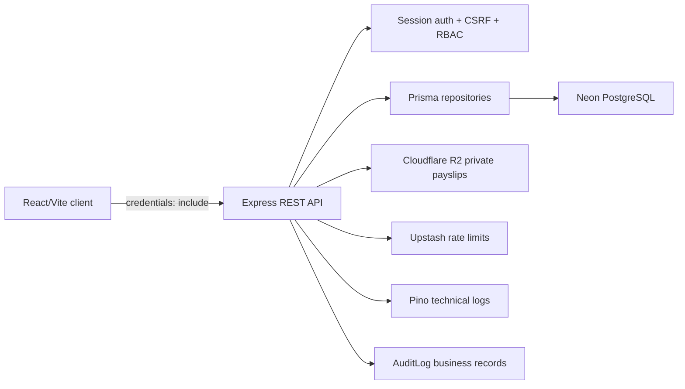
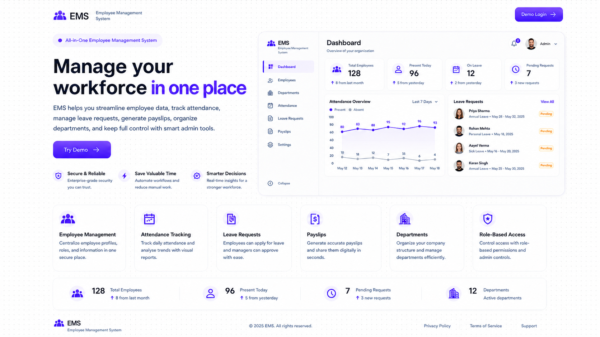
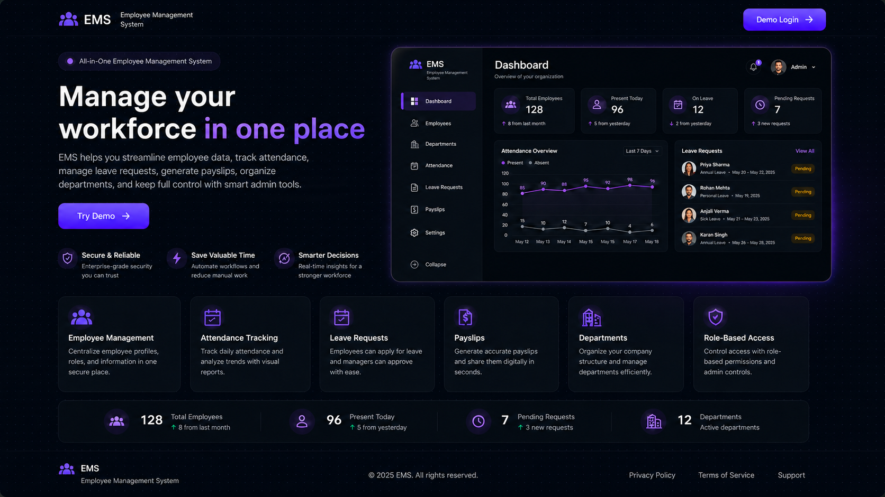
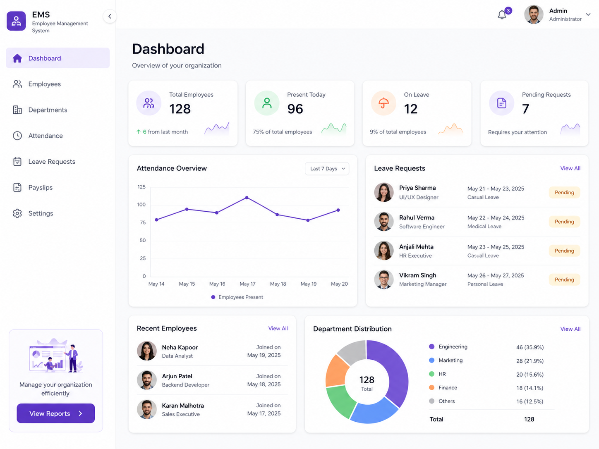
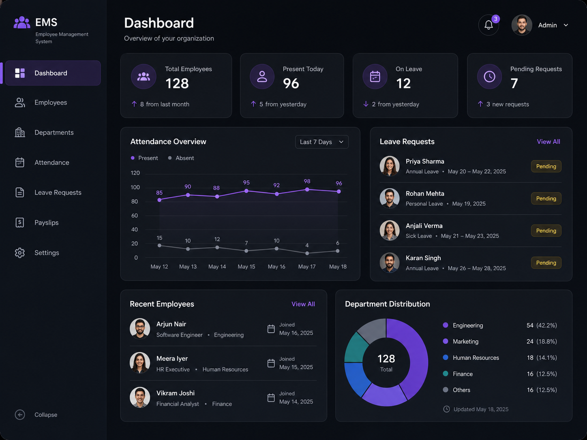

# Stafflow

Stafflow is a full-stack employee management system for a single company. It shows how admins can manage employees, departments, attendance, leave requests, payslips, settings, and audit logs while employees use a self-service workspace for their own attendance, leave, profile, and payslips.

Public registration is intentionally disabled: accounts are admin-created or seeded for review, and upload-heavy workflows are guarded so the app cannot become an open company workspace or an unbounded storage surface.

## Project overview

- Admins manage employee records, departments, leave reviews, attendance corrections, payslips, settings, and audit logs.
- Employees access only their own profile, attendance history, leave requests, and payslips.
- Review accounts let evaluators inspect both roles without creating accounts.
- The app is built as a portfolio-ready MVP with production-minded boundaries, not a public self-service SaaS onboarding flow.

## Review credentials

| Role                        | Email                       | Password       |
| --------------------------- | --------------------------- | -------------- |
| Admin review credentials    | `admin.demo@example.com`    | `StafflowDemo` |
| Employee review credentials | `employee.demo@example.com` | `StafflowDemo` |

## Tech stack

- Frontend: React, TypeScript, Vite, React Router, Tailwind CSS v4, shadcn/ui primitives, Lucide icons
- Server state: TanStack Query
- Forms and validation: React Hook Form and Zod
- Backend: Node.js, Express, TypeScript
- Database: PostgreSQL on Neon with Prisma ORM and Prisma migrations
- Auth: first-party email/password sessions with HTTP-only cookies
- Storage: Cloudflare R2 for private payslip PDFs
- Rate limiting: Upstash Redis
- Logging: Pino and Pino HTTP
- Deployment targets: Vercel frontend, Render backend, Neon database, Cloudflare R2, Upstash Redis

## Architecture summary



Frontend code is organized by feature under `client/src/features`, with shared UI, layout, query, and utility code under `client/src/shared`. Backend code is organized by domain under `server/src/modules`, while cross-cutting auth, errors, logging, storage, pagination, and middleware live under `server/src/core`.

## Security decisions

- No public self-registration or public company onboarding.
- New users are created only through admin flows, seed scripts, or controlled invitation/password setup flows.
- Sessions use HTTP-only cookies; auth tokens are never stored in `localStorage`.
- Session tokens are hashed before storage.
- Backend middleware enforces auth, RBAC, and resource ownership; frontend guards are UX only.
- Employee self-service routes derive identity from the session rather than trusting request body IDs.
- Payslip files stay private in R2; PostgreSQL stores metadata and object keys, not PDF contents.
- Sensitive values such as passwords, cookies, tokens, hashes, raw files, and signed URLs are not logged.
- Sensitive admin actions create audit log records separate from technical logs.

## Public access constraints

- Public registration is intentionally disabled.
- Review users are seeded and documented so reviewers can inspect both roles.
- Seeded account password changes are protected when public access protections are enabled.
- Public uploads are disabled or constrained through `DEMO_UPLOADS_ENABLED=false` and upload guards.
- Public review deployments are not intended to host real payroll or private employee documents.

## Local setup

Install dependencies from the repository root:

```bash
npm install
```

Create a local environment file:

```bash
cp .env.local.example .env.local
```

Run the client:

```bash
npm run dev:client
```

Run the API in a second terminal:

```bash
npm run dev:server
```

The Vite client defaults to `http://localhost:5173`, and the API defaults to `http://localhost:4000`.

## Environment variables

Core local variables:

- `NODE_ENV`: `development`, `test`, or `production`
- `PORT`: API port, usually `4000`
- `CLIENT_URL`: exact frontend origin for credentialed CORS
- `DATABASE_URL`: pooled PostgreSQL connection URL
- `DIRECT_URL`: direct PostgreSQL connection URL for Prisma migrations
- `DEMO_MODE`: enables public access protections when `true`
- `DEMO_UPLOADS_ENABLED`: controls whether public uploads are allowed

Production/storage variables:

- `PAYSLIP_MAX_UPLOAD_BYTES`
- `R2_ACCOUNT_ID`
- `R2_ACCESS_KEY_ID`
- `R2_SECRET_ACCESS_KEY`
- `R2_BUCKET_NAME`

Use `.env.local.example` and `.env.production.example` as the source templates.

## Database migrations

Prisma migrations are the only supported schema workflow:

```bash
npm run db:migrate:status
npm run db:migrate:deploy
```

Do not use `prisma db push`, reset/drop shared databases, or delete migrations for normal development.

## Seeding

Seed local review data:

```bash
npm run db:seed
```

Check seeded baseline data:

```bash
npm run db:seed:check
```

Bootstrap production review auth accounts when needed:

```bash
npm run db:bootstrap-demo-auth
```

## Deployment

- Deploy the frontend to Vercel.
- Deploy the Express API to Render.
- Use Neon PostgreSQL for the database.
- Use Cloudflare R2 for private payslip PDFs.
- Use Upstash Redis for distributed rate limiting.
- Set `CLIENT_URL` to the exact frontend origin and configure the frontend API URL for the Render API origin.
- Keep production cookies secure and cross-site compatible for the deployed frontend/API origins.

## Screenshots

### Homepage





### Dashboard





## Final QA checklist

- [ ] Homepage explains Stafflow quickly and links to login.
- [ ] Login page shows admin and employee review credentials where intended.
- [ ] Public registration remains absent and intentionally documented.
- [ ] Admin dashboard is readable on desktop, tablet, and mobile widths.
- [ ] Employee dashboard is readable on desktop, tablet, and mobile widths.
- [ ] Empty states explain what data will appear and how it is created.
- [ ] Payslip uploads remain disabled or constrained in public access mode.
- [ ] `npm run typecheck` passes.
- [ ] `npm run build:client` passes.
- [ ] `npm run format:check` passes.
